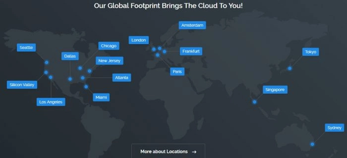
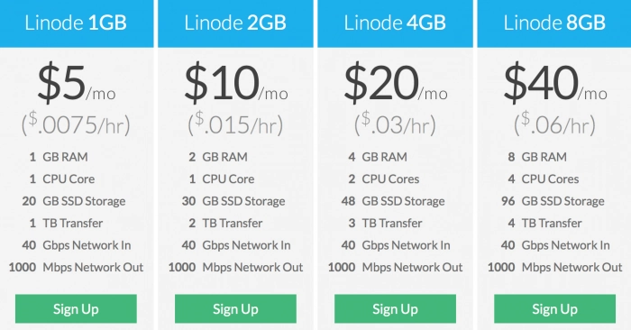
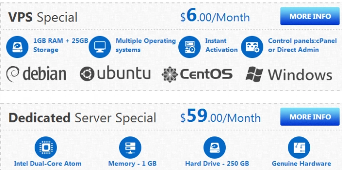
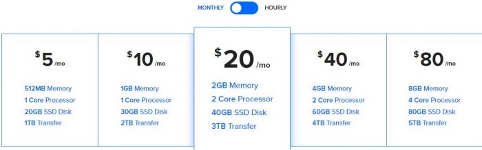

# Real User Review: 6 Most Cost-Effective VPS Providers Worth Your Investment

---

For users in mainland China and beyond, a reliable overseas VPS opens up countless possibilities—from setting up secure network access to hosting websites, building private cloud storage, or handling high-bandwidth downloads. After years of hands-on experience with multiple providers, I'm sharing these battle-tested VPS brands that actually deliver on their promises.

---

## Vultr: The Global Coverage Champion

Vultr stands out with 15 datacenters scattered across the globe—more than any competitor. Their Tokyo datacenter consistently ranks as the favorite among Chinese users for its reliable speeds.

The entry point starts at $2.50/month, but the $10/month plan hits the sweet spot: 2GB RAM, 1 CPU core, 2TB monthly bandwidth, and 40GB SSD storage. That's enough horsepower for most personal projects without breaking the bank.

What I appreciate most is how Vultr maintains consistent performance across regions. Whether you're deploying in Tokyo, Singapore, or Los Angeles, you're getting the same solid infrastructure underneath.

👉 **Looking for a VPS provider with truly global reach and rock-solid uptime?** [Vultr's datacenter network gives you deployment flexibility that's hard to match elsewhere](https://www.vultr.com/?ref=9738262-9J).

### Global Datacenter Comparison

| Region | Vultr (est. 2014) | Linode (est. 2003) | DigitalOcean (est. 2011) |
|--------|-------------------|--------------------|--------------------|
| **Americas** | Atlanta, Chicago, Silicon Valley, Dallas, Los Angeles, New York, Seattle, Miami | Fremont, Dallas, Atlanta, Newark | New York, San Francisco, Toronto (Canada) |
| **Europe** | London, Amsterdam, Paris, Frankfurt | London, Frankfurt | London, Frankfurt, Amsterdam |
| **Asia** | Tokyo, Singapore | Tokyo, Singapore, Mumbai (India) | Singapore, Bangalore (India) |
| **Oceania** | Sydney (Australia) | — | — |

## Linode: The Veteran's Choice

Linode has been in the game since 2003, earning its reputation through consistent service quality. Their Tokyo 2 datacenter and Fremont location (US West Coast) remain favorites for Chinese webmasters.

At $10/month, you're getting the same 2GB RAM as Vultr. But here's where Linode shines: their $5/month tier includes 1GB RAM—the best bang-for-buck in the industry for entry-level users who need decent specs without paying premium prices.

The platform feels more mature, with detailed documentation and a community that's been solving problems for over two decades. When something breaks at 3 AM, that accumulated knowledge becomes invaluable.

### Price Comparison: What Your Money Actually Buys

| Monthly Cost | Vultr | Linode | DigitalOcean |
|--------------|-------|--------|--------------|
| **$5/mo** | 25GB SSD, 1 CPU, 1GB RAM, 1TB bandwidth | 25GB storage, 1 CPU, 1GB RAM, 1TB transfer | 25GB SSD, 1 CPU, 1GB RAM, 1TB bandwidth |
| **$10/mo** | 40GB SSD, 1 CPU, 2GB RAM, 2TB bandwidth | 50GB storage, 1 CPU, 2GB RAM, 2TB transfer | 50GB SSD, 1 CPU, 2GB RAM, 2TB bandwidth |
| **$20/mo** | 60GB SSD, 2 CPU, 4GB RAM, 3TB bandwidth | 80GB storage, 2 CPU, 4GB RAM, 4TB transfer | 80GB SSD, 2 CPU, 4GB RAM, 4TB bandwidth |

## Interserver: The Hidden Gem

Here's something refreshing: Interserver remains relatively unknown in Chinese markets, which means cleaner network routes and better performance. They operate three self-owned datacenters in the United States, all equipped with 1Gbps connections.

The Los Angeles location consistently delivers solid speeds to Asia. Starting at $6/month for 1GB RAM on OpenVZ architecture, it's perfect for basic proxy setups. Use promo code **facebook50** for 50% off your first month—that's just $3 to test drive.

Yes, OpenVZ has limitations compared to KVM virtualization, but for straightforward deployments, it gets the job done at unbeatable prices.

## DigitalOcean: The Developer Favorite

Born in New York and backed by Y Combinator, DigitalOcean earned its reputation by making server deployment ridiculously fast. Spin up a new instance in under 20 seconds.

Their $5/month tier starts at 512MB RAM—a bit lean by today's standards—but the platform compensates with exceptional stability and developer-friendly features. The exclusive one-click AI/ML environment setup is genuinely useful if you're experimenting with machine learning workflows.

The trade-off? No Tokyo datacenter, so you're limited to their US West Coast location for Asia-Pacific access. But fewer Chinese users means cleaner routes and more consistent performance. Registration sometimes triggers manual review, but customer support typically resolves it within hours.

### Network Performance Snapshot

| Speed Test (Cachefly) | Vultr | Linode | DigitalOcean |
|------------------------|-------|--------|--------------|
| Download Speed | 227MB/s | 220MB/s | 197MB/s |

## BandwagonHost: The Budget King

When absolute rock-bottom pricing matters more than anything else, BandwagonHost delivers. Annual plans starting at just a few dollars attract massive numbers of Chinese users—which is both a blessing and a curse.

The OpenVZ architecture comes with one-click proxy setup in the control panel, making it beginner-friendly. But keep expectations realistic: overselling happens, BBR or other acceleration algorithms are difficult to implement, and stability can be hit-or-miss.

Think of it as a learning sandbox, not a production environment. For experimenting and getting your feet wet without financial risk, it's hard to beat.

## Hengtian Host: The Local Specialist

A domestic provider offering Hong Kong VPS without the mainland filing requirements. Pricing is remarkably competitive—shared hosting runs under 100 RMB annually, while dedicated IP virtual hosting in Hong Kong stays around 100-200 RMB/year even with SSL certificates included.

Their Hong Kong VPS servers, priced under 1,000 RMB annually, run on XEN architecture and work well for Hong Kong-based proxy setups. The real advantage is Chinese-language support and local payment methods when dealing with issues.

Watch for promotional emails—renewal discounts often make subsequent years even cheaper.

---

## Payment Options and Assistance

Most providers accept credit cards and PayPal, with Vultr and Hengtian Host also supporting Alipay for Chinese users. Need help with purchasing? Reach out to w@wasai.org for assistance.

---

After testing dozens of VPS providers over the years, these six consistently deliver the best combination of performance, price, and reliability. **Whether you need global coverage, maximum RAM per dollar, or specialized regional access,** [Vultr's extensive datacenter network and straightforward pricing make it the go-to choice for most deployment scenarios](https://www.vultr.com/?ref=9738262-9J).
